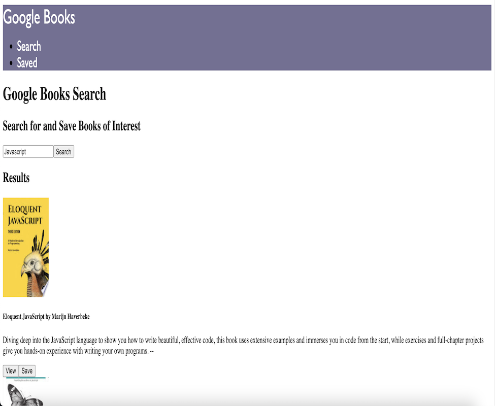

# Google Books Search

React-based Google Books Search app using Node, Express and MongoDB.

## Deployment

Deployed to Heroku @

[Google Books Search](https://fathomless-fjord-21002.herokuapp.com/)

## Screenshots

## License

[MIT](https://choosealicense.com/licenses/mit/)

## Authors

- [@karizmatik215](https://www.github.com/karizmatik215)
